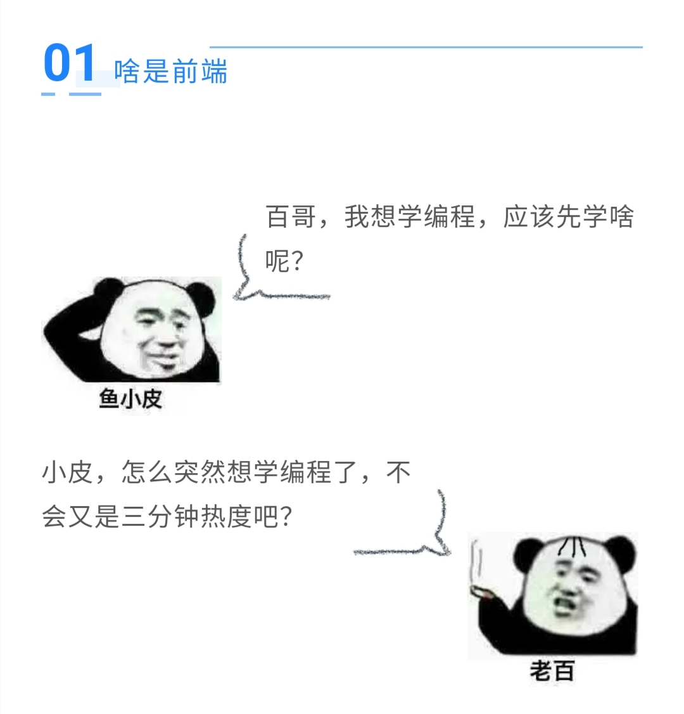

# 编程百晓生

> 搞笑通俗的编程知识大百科

在线阅读：https://code-master.vercel.app

## 漫画形式，轻松学知识

## 阅读

关注公众号 "鱼皮客栈"，回复 "百科"，阅读体验更佳。

## 目录

[01 啥是前端？](articles/01.md)

[02 大的数据就是大数据？](articles/02.md)

[03 我竟然被狗狗币勒索了？](articles/03.md)

